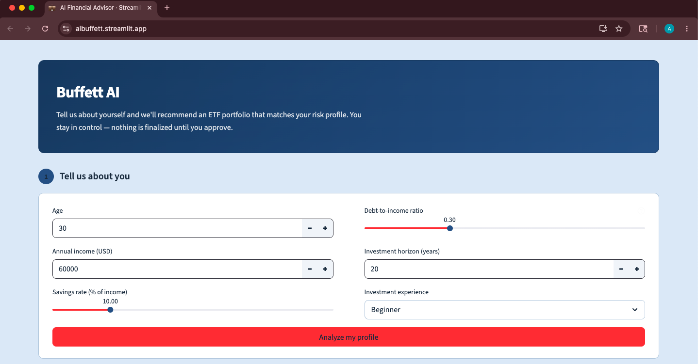

<div align="center">

# Buffett AI

**An AI-powered financial advisor that profiles your risk tolerance, recommends an ETF portfolio, and explains its reasoning in plain English.**

[](https://python.org)
[](https://streamlit.io)
[](https://xgboost.readthedocs.io)
[](https://docs.anthropic.com)
[](LICENSE)

[Try the Demo](https://aibuffett.streamlit.app) &bull; [Architecture](#architecture) &bull; [Quick Start](#quick-start) &bull; [Contributing](CONTRIBUTING.md)

</div>

---

Buffett AI is a four-layer AI system that takes a user's financial profile, predicts their risk tolerance with an XGBoost classifier, selects ETFs with live market data, and generates a personalized explanation using Claude — all with a human-in-the-loop approval step before any recommendation is finalized.

> **Disclaimer:** This is an educational project. It does not execute trades, hold funds, or produce legally binding recommendations. Consult a licensed professional before making investment decisions.

<p align="center"></p>

## Architecture

The system is built as four independent layers that compose through a shared Streamlit interface:

```
User Input
    |
    v
[ Layer 1: ML Risk Classifier ]      XGBoost model trained on 2,000 investor profiles
    |                                  SHAP explainability on every prediction
    v
[ Layer 2: Generative AI ]            Claude API generates plain-English explanations
    |                                  Guardrails prevent hallucinated tickers & return claims
    v
[ Layer 3: Agentic AI ]               Live ETF selection via yfinance
    |                                  Deterministic tier-to-ETF mapping with price fallback
    v
[ Layer 4: Responsible AI ]           Bias audit across age bands
    |                                  Model card, decision logging, human approval gate
    v
User Approval (accept / reject)
```

| Layer | What it does | Key tech |
|-------|-------------|----------|
| **ML Risk Classifier** | Predicts Low / Medium / High risk tier from financial profile | XGBoost, SHAP, scikit-learn |
| **Generative AI** | Writes a 2-3 sentence explanation of the recommendation | Claude API (Anthropic) |
| **Agentic AI** | Fetches live ETF prices and builds a shortlist for the user's tier | yfinance, rule-based agent |
| **Responsible AI** | Bias audit, model card, decision log, human-in-the-loop gate | SHAP, pandas |

## Quick Start

```bash
# Clone the repo
git clone https://github.com/FromHarley/ai-financial-advisor-.git
cd ai-financial-advisor-

# Create a virtual environment
python -m venv .venv
source .venv/bin/activate   # macOS/Linux
# .venv\Scripts\activate    # Windows

# Install dependencies
pip install -r requirements.txt

# Configure API keys
cp .env.example .env
# Edit .env and add your ANTHROPIC_API_KEY

# Run the app
streamlit run app.py
```

The app opens at `http://localhost:8501`. Enter a financial profile, get a risk tier, ETF recommendations, and a plain-English explanation — then approve or reject.

## How It Works

1. **You enter your profile** — age, income, savings rate, debt-to-income ratio, investment horizon, and experience level
2. **The ML model predicts your risk tier** — XGBoost classifies you as Low, Medium, or High risk (84% accuracy, macro F1 0.81) with a SHAP waterfall plot showing exactly which features drove the prediction
3. **The agent picks ETFs** — a rule-based agent maps your tier to an ETF shortlist and pulls live prices via yfinance
4. **Claude explains the recommendation** — Anthropic's Claude API generates a 2-3 sentence explanation using hedged language, restricted to only the ETFs in context
5. **You decide** — nothing is logged until you explicitly accept or reject. This is the human-in-the-loop checkpoint

## Model Performance

| Metric | Value |
|--------|-------|
| Overall accuracy | 84.0% |
| Macro F1 | 0.81 |
| Training samples | 2,000 (80/20 split) |
| Per-class F1 | Low 0.77 · Medium 0.87 · High 0.80 |

Full details in the [model card](layer4_respai/model_card.md).

## Project Structure

```
ai-financial-advisor/
├── app.py                    # Streamlit entry point
├── requirements.txt          # Pinned dependencies
├── .env.example              # API key template
│
├── layer1_ml/                # XGBoost risk classifier + SHAP
│   ├── train.py              # Offline training script
│   ├── predict.py            # Runtime inference + SHAP plots
│   └── model.pkl             # Trained model artifact
│
├── layer2_genai/             # Claude-powered explanation layer
│   ├── claude_client.py      # API client
│   └── prompts.py            # System + user prompt templates
│
├── layer3_agentic/           # ETF recommendation agent
│   ├── etf_agent.py          # yfinance integration + caching
│   └── tier_mapping.py       # Tier-to-ETF rules
│
├── layer4_respai/            # Responsible AI layer
│   ├── bias_audit.py         # Age-band fairness audit
│   ├── decision_log.py       # Append-only CSV logger
│   └── model_card.md         # Full model documentation
│
├── data/
│   ├── financial_risk_profiles.csv   # Training data (2,000 rows)
│   └── cfpb_financial_wellbeing.csv  # Bias audit reference data
│
└── docs/                     # Internal documentation
```

## Responsible AI

We take transparency seriously, even in a demo:

- **Explainability** — every prediction includes a SHAP waterfall plot showing which features pushed the risk tier up or down
- **Bias audit** — tier distributions are analyzed across CFPB age bands; findings are documented in the [model card](layer4_respai/model_card.md) with honest caveats about proxy limitations
- **Guardrails** — Claude's system prompt enforces hedged language, prohibits return projections, and restricts output to only the ETFs provided in context
- **Human oversight** — no recommendation is logged without explicit user approval
- **Disclaimer** — every AI-generated explanation ends with a mandatory disclaimer

## API Keys

| Key | Required | Used by |
|-----|----------|---------|
| `ANTHROPIC_API_KEY` | Yes | Layer 2 — Claude generates explanations |
| `OPENAI_API_KEY` | No | Voice interface only (Whisper transcription) |

Copy `.env.example` to `.env` and add your keys. Never commit `.env`.

## Team

Built by a four-person team at Rowan University:

- **Alexander Harley** — ML layer, project lead, deployment
- **Daniel Duffy** — Responsible AI, bias audit, model card
- **Anurag Luhar** — Generative AI, Claude integration
- **Kimberly Ting** — Agentic AI, ETF agent, market data

## License

[MIT](LICENSE)
